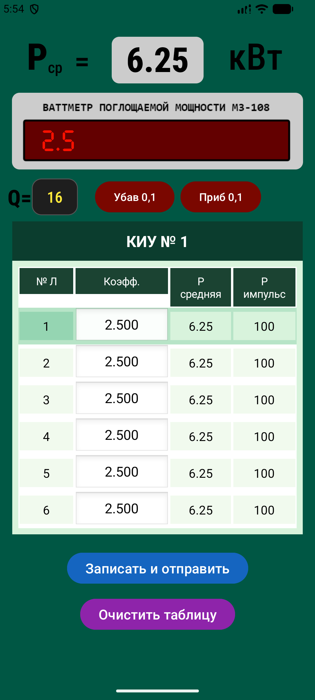

# PowerM3108

Android‑приложение Калькулятор мощности с таблицей результатов.

---

## Скриншот главного экрана



Это главный экран приложения Power M3-108.

## ⚠️ Важное предупреждение по сборке

Из‑за проблем с доступом к `dl.google.com` (актуально для ряда регионов) сборка требует **локального репозитория** с артефактом `aapt2`. Это временное техническое решение, чтобы проект собирался без сбоев.

**Папка `local-repo` намеренно не хранится в Git** — она добавлена в `.gitignore`. Без неё сборка завершится ошибкой вида:
> Could not find aapt2-9.1.0-14792394-windows.jar

---

## 🚀 Быстрый старт (если всё уже настроено)

Если у тебя уже есть папка `local-repo` и ты просто хочешь собрать проект:

```bash
./gradlew clean assembleDebug
